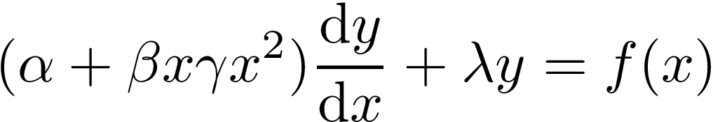

# Analytic Continuation Project

This project aims to build analytic continuation for a differential equation presented to me in my class in the context of a "game:"

The alpha, beta, gamma, and lambda are constants and f(x) is any function. The goal is to model y 
